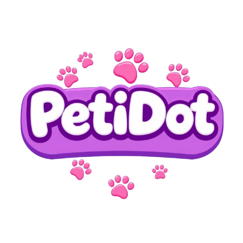

<p align="center">
  
</p>

# PetiDot - Polkadot Pet Game

A simple blockchain-based idle game where users can collect, train, and earn unique NFT pets on a Polkadot asset hub network.

## Overview

PetiDot allows users to connect their Web3 wallet (like MetaMask) to interact with a smart contract managing PetiDot NFT pets. Users can mint new pets, view their collection, customize their pets' names, train them to advance their age stage, and send them out for playtime to potentially earn reward NFTs.

## Features

*   **Wallet Connection:** Connect using MetaMask or other compatible Web3 wallets via ethers.js.
*   **Pet Minting:** "Open a Box" to mint a new, randomly generated PetiDot NFT with unique type and rarity attributes.
*   **Pet Collection Viewing:** Display all owned PetiDot NFTs with their details (Name, ID, Type, Rarity, Age Stage, Staking Status).
*   **Name Customization:** Change the name of your owned pets.
*   **Training (Age Staking):** Stake pets to train them. After a set duration (e.g., 30 days in the contract), unstaking advances the pet's age stage (Baby -> Teen -> Adult).
*   **Playtime Staking:** Send your pets to Playtime to earn rewards.
*   **Playtime Rewards:** Claim a reward (another PetiDot NFT, potentially based on the staked pet's rarity/age) after the Playtime staking period ends.
*   **NFT Details Display:** View individual pet details including name, type, rarity (Common, Uncommon, Rare, Legendary), age stage (Baby, Teen, Adult), and staking status.
*   **Reward Modals:** See the pet you received after opening a box or claiming a playtime reward.

## Tech Stack

*   **Frontend:** React, Vite, Material-UI
*   **Blockchain Interaction:** ethers.js
*   **Network:** Polkadot Westend Testnet AssetHub (Contract Adress : 0x62719afbd53e1ebba97ac8efb3affdc9279a4f60)

## Setup and Running

1.  **Prerequisites:**
    *   Node.js and npm (or yarn) installed.
    *   A Web3 wallet browser extension (e.g., MetaMask) installed.
2.  **Clone the Repository:**
    ```bash
    git clone <repository_url>
    ```
3.  **Install Dependencies:**
    ```bash
    npm install
    # or
    yarn install
    ```
4.  **Configure Wallet:**
    *   Ensure your wallet is connected to the correct network where the `PetGameContract` is deployed
    *   Make sure you have some testnet tokens for gas fees.
5.  **Run the Frontend:**
    ```bash
    npm run dev
    # or
    yarn dev
    ```
6.  Open your browser to the local development server URL provided (usually `http://localhost:5173`).

## Smart Contract

*   The core logic resides in the `PetGameContract.sol` file.
*   Deployed Address: `0x62719afbd53e1ebba97ac8efb3affdc9279a4f60` (on the specified network)
*   The contract handles minting, staking, reward calculation, and ownership.

## Basic Gameplay Loop

1.  **Connect:** Connect your wallet to the application.
2.  **Mint:** Click "Open a New Pet Box!" to receive your first PetiDot NFT. Gas fees apply.
3.  **View:** See your new pet appear in the "Your Pets" section.
4.  **Customize:** Click the edit icon on an unstaked pet's card to give it a unique name.
5.  **Train:** Click the "Train" button on an eligible (Baby/Teen, unstaked) pet card to stake it for age progression.
6.  **Playtime:** Select an eligible (unstaked) pet and click "Stake Selected Pet for Playtime" to earn rewards.
7.  **Wait & Unstake/Claim:**
    *   After the training duration, the "Finish Training" button will appear on the card. Click it to unstake and advance the pet's age stage.
    *   After the playtime duration, the "Claim Reward" button will appear on the card. Click it to receive a new reward pet.
8.  **Repeat:** Collect more pets, train them, and send them for playtime!

## Game Screenshots


